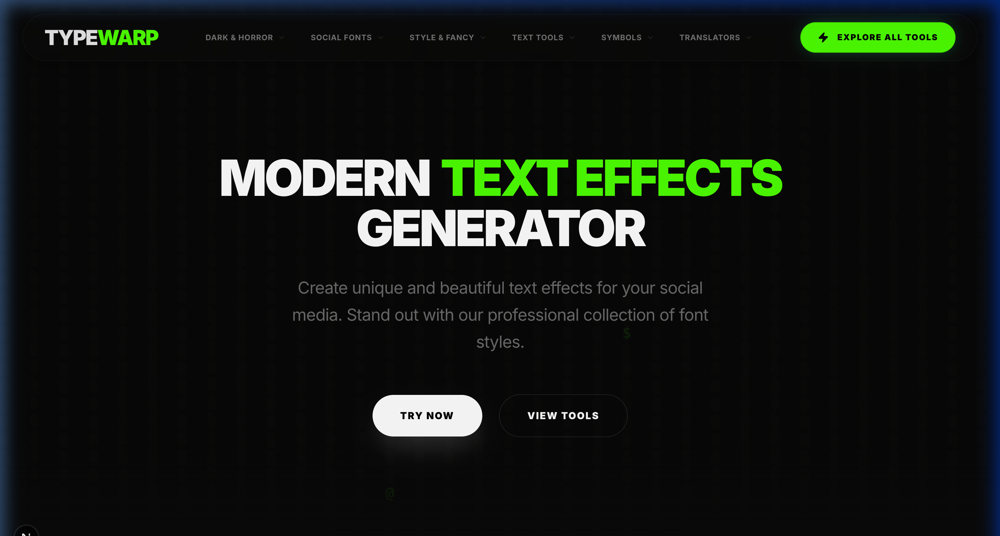
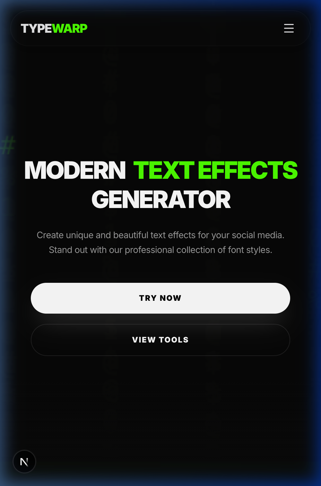
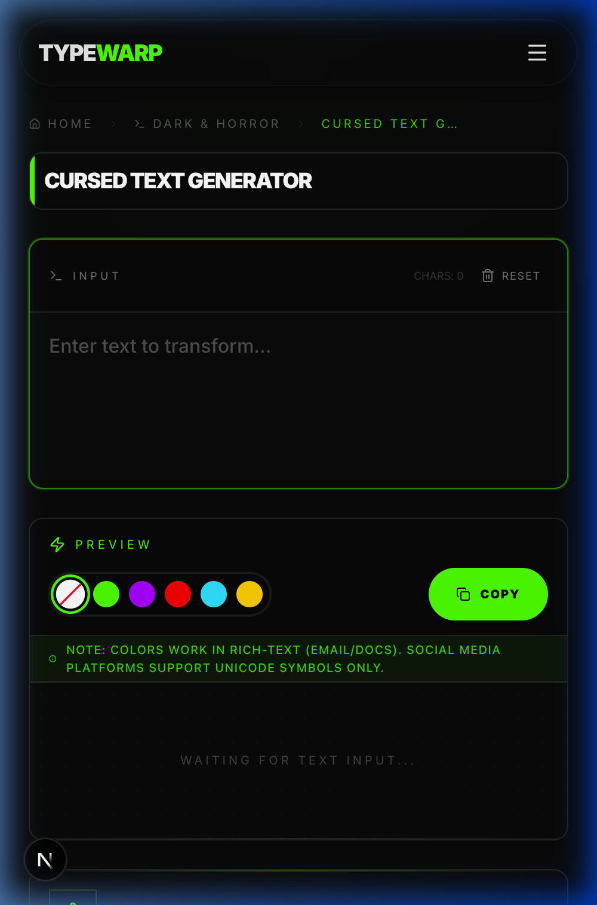
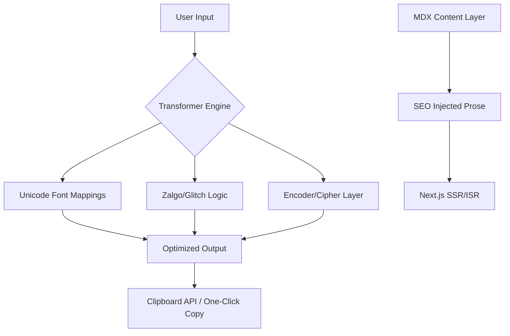

<div align="center">

# ⚡ TypeWarp

### The Ultimate Nexus for Advanced Typography & Cursed Character Engineering

[](https://nextjs.org/)
[](https://www.typescriptlang.org/)
[](https://tailwindcss.com/)
[](#license)

**[TypeWarp](https://www.typewarp.com)** is a high-performance, professional-grade typography platform designed for creators, developers, and digital architects. Featuring **86+ surgical-grade tools**, TypeWarp enables precision manipulation of Unicode, Zalgo-injection, and complex character transformations for social media, gaming, and secure encoding.

[🌐 Live Environment](https://www.typewarp.com) · [📝 Technical Blog](https://www.typewarp.com/blog) · [🛠️ Repository of Tools](https://www.typewarp.com/collection)

---

<div align="center">
  
  <br />
  
  &nbsp;&nbsp;&nbsp;&nbsp;
  
</div>

---

## 💎 Core Value Proposition

TypeWarp transcends simple text generation by providing a robust infrastructure for character-level manipulation. Built with a focus on **speed, SEO, and visual excellence**, it serves as the definitive toolkit for modern digital expression.

- **86+ Advanced Tools:** Spanning Zalgo-corruption, aesthetic fonts, and technical translators.
- **Zero-Latency Processing:** Real-time transformations powered by optimized hydration strategies.
- **Cyber-Void Aesthetic:** A premium, immersive dark theme with high-contrast accents and glitch micro-interactions.
- **SEO-First Content Architecture:** Massive text-to-HTML optimization with 100+ dynamic content layers and a 5000+ word technical glossary.
- **Platform-Agnostic Output:** Perfectly formatted Unicode strings ready for Instagram, TikTok, Discord, and Telegram.

---

## 🧰 The Engine Rooms

### 💀 Dark & Horror (13 Tools)

_Character corruption and entropy injection._

> Zalgo Script · Zalgo Text · Glitch Text · Corrupted Content · Demonic Script · Biohazard Typography

### 📱 Social Forge (9 Tools)

_Platform-specific optimization for social media dominance._

> Instagram BIO Fonts · Discord Chat Mods · TikTok Trending Styles · Gaming Clan Tags

### ✨ Style & Aesthetic (14 Tools)

_High-end typographic elegance._

> Vaporwave Aesthetics · Calligraphy Scripts · Cursive Flow · Monospace Tech Fonts

### 🔧 Utility & Manipulation (27 Tools)

_Surgical text formatting and metadata control._

> Character Counters · Invisible Null-Width Strings · Title Case Converters · Mirror Reflection

### 🔣 Symbolic Lexicon (9 Tools)

_Extensive Unicode symbol libraries._

> Kaomoji Generators · Lenny Face Archives · Combat Symbols · Aesthetic Accents

### 🌐 Universal Translators (14 Tools)

_Multi-layer encoding and secure ciphers._

> Caesar Ciphers · Base64 Logic · Morse Telemetry · NATO Phonetic Protocol

---

## 🏗️ Technical Architecture



### 🛠️ Tech Stack

| Component      | Technology              | Rationale                                                    |
| :------------- | :---------------------- | :----------------------------------------------------------- |
| **Framework**  | Next.js 15 (App Router) | Utilizing Server Components for zero-bundle core logic.      |
| **Language**   | TypeScript 5            | Strict typing for complex character mapping schemas.         |
| **Styling**    | Tailwind CSS 4          | Atomic utility design for the custom Void Theme.             |
| **Animations** | Framer Motion           | Fluid micro-animations and layout transitions.               |
| **Scrolling**  | Lenis                   | High-fidelity smooth scrolling engine.                       |
| **Content**    | MDX + Shiki             | Dynamic, SEO-rich content delivery with syntax highlighting. |

---

## 🚀 Deployment & Development

### 1. Project Initialization

```bash
git clone https://github.com/link-masters/typewarp.git
cd typewarp
npm install
```

### 2. Local Engineering Environment

```bash
npm run dev
```

### 3. Production Compilation

```bash
npm run build
npm start
```

_Note: Configured for `standalone` output mode to optimize for containerized deployments._

---

## 🧩 Extension Framework (Adding Tools)

TypeWarp is designed for modularity. To integrate a new character effect:

1.  **Define Logic:** Add a transformation function in `src/lib/transformers.ts`.
2.  **Register Meta:** Update the tool manifest in `src/lib/categories.ts`.
3.  **Content Injection:** Create an SEO-rich `.mdx` entry in `src/content/tools/`.
4.  **Verification:** Test responsiveness and character compatibility across platforms.

---

## 📈 SEO & Performance Metrics

- **Core Web Vitals:** Optimized for 99+ Lighthouse scores.
- **JSON-LD Schema:** Comprehensive `WebSite` and `Organization` structured data.
- **Dynamic Sitemaps:** Real-time generation for all 107+ routes.
- **Semantic HTML:** Strict adherence to hierarchy for maximum crawlability.

---

## 📄 Proprietary Notice

This software is **Proprietary**. All rights to the logic, design, and content are reserved. Unauthorized reproduction or distribution is strictly prohibited.

Built with technical excellence by the **TypeWarp Team**.
