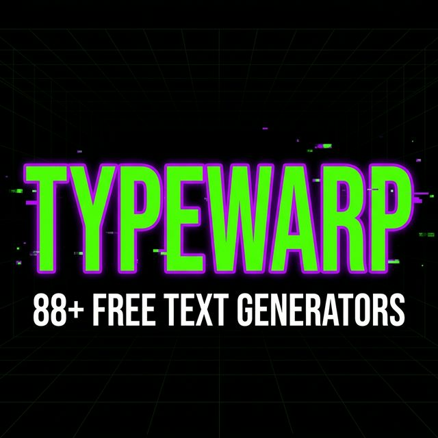

<div align="center">

# ⚡ TypeWarp

### The Ultimate Cursed Text & Typography Toolkit

[](https://nextjs.org/)
[](https://www.typescriptlang.org/)
[](https://tailwindcss.com/)
[](#license)

**TypeWarp** is a professional-grade text transformation platform offering **81+ tools** across 6 categories — from cursed & Zalgo text generators to encoders, ciphers, and fancy Unicode fonts. Built for creators, developers, and social media power users.

[🌐 Live Site](https://www.typewarp.com) · [📝 Blog](https://www.typewarp.com/blog) · [🛠️ All Tools](https://www.typewarp.com/collection)



</div>

---

## 📋 Table of Contents

- [Features](#-features)
- [Tool Categories](#-tool-categories)
- [Tech Stack](#-tech-stack)
- [Getting Started](#-getting-started)
- [Architecture](#-architecture)
- [Adding New Tools](#-adding-new-tools)
- [Configuration](#%EF%B8%8F-configuration)
- [SEO & Performance](#-seo--performance)
- [Deployment](#-deployment)
- [License](#-license)

---

## ✨ Features

| Feature                  | Description                                                        |
| ------------------------ | ------------------------------------------------------------------ |
| **81+ Text Tools**       | Comprehensive toolkit spanning 6 categories                        |
| **Real-time Preview**    | See transformations instantly as you type                          |
| **One-Click Copy**       | Copy generated text to clipboard instantly                         |
| **Dark Cyberpunk Theme** | Immersive design with glitch effects & neon aesthetics             |
| **Fully Responsive**     | Optimized for desktop, tablet, and mobile devices                  |
| **SEO Optimized**        | Structured data (JSON-LD), Open Graph, Twitter Cards, sitemap, RSS |
| **Blog Section**         | 17+ MDX-powered articles with syntax highlighting                  |
| **Smooth Scrolling**     | Butter-smooth scroll experience powered by Lenis                   |
| **Accessibility**        | Skip-to-content links, semantic HTML, ARIA support                 |
| **GDPR Compliant**       | Cookie consent banner and privacy-first design                     |

---

## 🧰 Tool Categories

### 💀 Dark & Horror — 13 tools

Unleash chaos with cursed, Zalgo, and glitch text generators. Create eerie, corrupted, and unsettling typography.

> Cursed Text · Zalgo Text · Glitch Text · Weird Text · Creepy Text · Corrupted Text · Demonic Text · Scary Text · Gothic Font · Special Text · Extra Thicc Text · Glitter Text · Square Text

### 📱 Social Fonts — 9 tools

Platform-optimized fonts for Instagram, Discord, TikTok, Twitter, Facebook, and gaming communities.

> Instagram Font · Discord Font · TikTok Font · Facebook Font · Twitter Font · Gaming Font · Fortnite Font · Clan Tag · Fancy Font

### ✨ Style & Fancy — 14 tools

Aesthetic, vaporwave, and premium text designs — calligraphy, cursive, bubble, wide, and typewriter styles.

> Fancy Font · Aesthetic Font · Stylish Font · Vaporwave Text · Aesthetic Text · Cute Font · Calligraphy Font · Cursive Font · Bubble Text · Wide Text · Monospace Text · Premium Font · Typewriter Font · Scary Text

### 🔧 Text Tools — 21 tools

Essential formatting and manipulation utilities like bold, italic, underline, strikethrough, counters, and generators.

> Bold Text · Italic Text · Underline Text · Strikethrough Text · Small Text · Tiny Text · Big Text · Superscript · Upside Down Text · Mirror Text · Space Remover · Text Cleaner · Sentence Case · Character Counter · Invisible Character · Box Text · Sparkle Text · Slashed Text · Aggressive Text · Playful Text · Glitter Text

### 🔣 Symbols — 8 tools

Special characters, emoticons, aesthetic symbols, and famous face generators.

> Text Symbols · Aesthetic Symbols · Special Characters · Text Emoticons · Lenny Face · Combat Symbols · Mirror Symbols · Tech Symbols

### 🌐 Translators — 16 tools

Encode, decode, and translate text across Morse code, binary, Braille, Base64, ciphers, and more.

> Morse Code · Braille · Binary · Hex · Base64 · Reverse Text · Caesar Cipher · ROT13 · NATO Phonetic · Atbash Cipher · Leetspeak · Wingdings · Runic · Old English · Sign Language · ASCII Art

---

## 🏗️ Tech Stack

| Layer          | Technology                                                                | Purpose                                    |
| -------------- | ------------------------------------------------------------------------- | ------------------------------------------ |
| **Framework**  | [Next.js 16](https://nextjs.org/)                                         | App Router, SSR, ISR, API routes           |
| **Language**   | [TypeScript 5](https://www.typescriptlang.org/)                           | Type safety across the codebase            |
| **Styling**    | [Tailwind CSS 4](https://tailwindcss.com/)                                | Utility-first CSS framework                |
| **Animations** | [Framer Motion](https://www.framer.com/motion/)                           | Declarative animations & gestures          |
| **Content**    | [MDX](https://mdxjs.com/) + [Shiki](https://shiki.matsu.io/)              | Rich blog content with syntax highlighting |
| **Icons**      | [Lucide React](https://lucide.dev/) + [Heroicons](https://heroicons.com/) | Icon systems                               |
| **Scrolling**  | [Lenis](https://lenis.darkroom.engineering/)                              | Smooth scroll engine                       |
| **Email**      | [Nodemailer](https://nodemailer.com/)                                     | Contact form email delivery                |
| **Fonts**      | Inter + JetBrains Mono                                                    | Google Fonts with `next/font` optimization |

---

## 🚀 Getting Started

### Prerequisites

- **Node.js** ≥ 18.x
- **npm**, **yarn**, **pnpm**, or **bun**

### Installation

```bash
# Clone the repository
git clone https://github.com/link-masters/typewarp.git
cd typewarp

# Install dependencies
npm install
```

### Development

```bash
npm run dev
```

Open [http://localhost:3000](http://localhost:3000) to view the app.

### Production Build

```bash
npm run build
npm start
```

### Linting

```bash
npm run lint
```

---

## 🏛️ Architecture

```
┌──────────────────────────────────────────────────────────────┐
│                       Next.js App Router                     │
├──────────────┬──────────────┬──────────────┬─────────────────┤
│  Static Pages│Dynamic Routes│  API/Actions │   RSS/Sitemap   │
│  (about,     │ [category]/  │  (contact    │   (robots.ts,   │
│   privacy…)  │  [tool]/     │   form)      │    sitemap.ts)  │
├──────────────┴──────────────┴──────────────┴─────────────────┤
│                      Component Layer                         │
│  Header · Hero · ToolView · FeaturedTools · Footer · GDPR   │
├──────────────────────────────────────────────────────────────┤
│                     Content Layer (MDX)                       │
│            107 Tool Pages  ·  17 Blog Articles               │
├──────────────────────────────────────────────────────────────┤
│                    Core Engine (lib/)                         │
│  transformers.ts · fontMappings.ts · cursed.ts · categories  │
└──────────────────────────────────────────────────────────────┘
```

**Key design decisions:**

- **Dynamic routing** via `[category]/[tool]` for clean, SEO-friendly URLs
- **MDX content** decoupled from UI — tools & blog posts are authored as `.mdx` files
- **Centralized transformer engine** (`transformers.ts`) powers all 81+ text transformations
- **Standalone output** mode for containerized deployments
- **Security headers** (CSP, X-Frame-Options, CORS) configured in `next.config.ts`

---

## 🧩 Adding New Tools

1. **Create the MDX content** — Add a new file at `src/content/tools/<tool-slug>.mdx`:

   ```mdx
   ---
   title: "Your Tool Name"
   description: "A brief description of what this tool does."
   category: "category-slug"
   ---

   Your tool content here with rich MDX support.
   ```

2. **Register the tool** — Add an entry to the appropriate category in `src/lib/categories.ts`:

   ```ts
   { name: "Your Tool Name", slug: "your-tool-slug", icon: "🎯" }
   ```

3. **Add the transformer** — Implement the text transformation logic in `src/lib/transformers.ts`.

4. **Configure the tool** — Add tool-specific settings (FAQs, examples, etc.) in `src/lib/toolConfig.ts`.

5. **Verify** — Run `npm run dev` and navigate to `/<category-slug>/<tool-slug>`.

---

## ⚙️ Configuration

### Site Config (`src/lib/config.ts`)

Centralized configuration for the site URL, used across SEO metadata, sitemaps, OG images, and canonical links.

### Next.js Config (`next.config.ts`)

Key configurations include:

- **Image optimization** — AVIF/WebP formats, aggressive caching (1 year TTL)
- **Security headers** — CSP, X-Frame-Options (DENY), Referrer-Policy
- **Static asset caching** — Long-lived cache for `.png` and `.webp` files
- **URL redirects** — 18+ permanent redirects for legacy/renamed tool paths
- **Production optimizations** — Console removal, CSS optimization, standalone output

---

## 📈 SEO & Performance

TypeWarp implements comprehensive SEO and performance optimizations:

- **Structured Data** — JSON-LD for `WebSite` and `Organization` schemas
- **Dynamic Sitemap** — Auto-generated from categories, tools, and blog posts
- **RSS Feed** — `/rss.xml` for blog syndication
- **Robots.txt** — Programmatically generated with appropriate disallow rules
- **Open Graph & Twitter Cards** — Rich previews on social platforms
- **Font optimization** — `next/font` with `display: swap` and preloading
- **Image optimization** — Next.js `<Image>` with AVIF/WebP format selection
- **CSS optimization** — Experimental `optimizeCss` enabled
- **Console stripping** — Automatic console removal in production builds

---

## 🚢 Deployment

### Vercel (Recommended)

[](https://vercel.com/new?utm_medium=default-template&filter=next.js&utm_source=create-next-app&utm_campaign=create-next-app-readme)

1. Push your repository to GitHub
2. Import the project on [Vercel](https://vercel.com)
3. Configure your environment variables in the Vercel dashboard
4. Deploy

### Docker / Self-Hosted

The app is configured with `output: "standalone"` for containerized deployment:

```bash
npm run build
# The standalone output is in .next/standalone/
node .next/standalone/server.js
```

---

## 📄 License

This project is **proprietary**. All rights reserved.

---

<div align="center">

**Built with 🖤 by the [TypeWarp](https://www.typewarp.com) Team**

</div>
